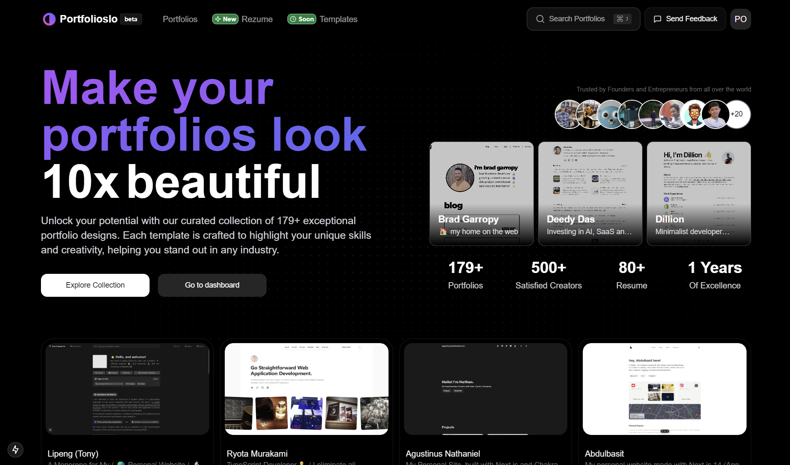

  
  <h1>PortfoliosWorld</h1>
  
The best place to find portfolio inspiration

  <a href="https://www.portfoliosworld.com">View Live Demo</a> •
  <a href="#features">Features</a> •
  <a href="#showcase">Showcase</a> •
  <a href="#getting-started">Getting Started</a>

## 🚀 About PortfoliosWorld

Portfoliosio is your ultimate destination for portfolio inspiration. We've curated a collection of 309+ exceptional portfolio designs to help creators, developers, and designers craft their perfect online presence. Our platform showcases the best portfolio examples from around the world, making it easier for you to create a standout portfolio that captures attention and demonstrates your unique skills.

## ✨ Key Features

- **Curated Collection**: Browse through 309+ handpicked portfolio designs
- **Resume Templates**: Access professionally designed resume templates
- **Portfolio Templates**: Coming soon - customizable portfolio templates
- **Search & Filter**: Easily find portfolios by industry, style, or technology
- **Responsive Design**: Perfect viewing experience across all devices

## 📊 Platform Statistics

- **179+** Curated Portfolios
- **500+** Satisfied Creators
- **80+** Resume Templates
- **1 Year** of Excellence

## 🎯 Why Choose PortfoliosWorld?

- **Inspiration**: Discover unique portfolio designs from successful professionals
- **Diversity**: Examples from various industries and creative fields
- **Modern Design**: Contemporary, clean interface for easy browsing
- **Regular Updates**: New portfolios added regularly
- **Community Driven**: Built for creators, by creators

## 🚀 Getting Started

1. Visit [portfoliosio.vercel.app](https://portfoliosio.vercel.app)
2. Browse through our curated collection
3. Filter by your preferred category
4. Click on any portfolio to view details
5. Get inspired and create your own amazing portfolio!

## 🛠️ Technologies Used

- Next.js
- React
- Tailwind CSS
- TypeScript
- Vercel

## 📫 Contact & Support

Have questions or suggestions? We'd love to hear from you!

- **Website**: [www.portfoliosworld.com](https://portfoliosio.vercel.app)
- **Feedback**: Use the "Send Feedback" button on our platform
- **Email**: support@portfoliosio.com

## 📝 License

This project is licensed under the MIT License - see the [LICENSE.md](LICENSE.md) file for details.

---

  Made with ❤️ by the PortfoliosWorld Team

